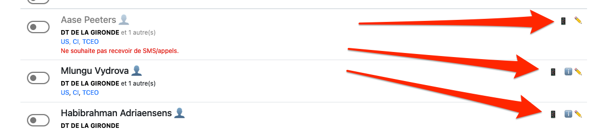
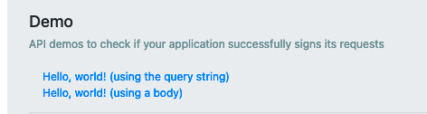
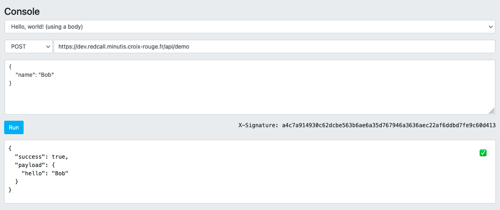

# FIC

### Simulators

A sandboxed environment is deployed in preprod so you can create "real" triggers, no real communications will be sent to people.

In the communication status page, click on the small icons located at the right side to open simulators.

### API console

Requests are signed which may harden your tests, but on every endpoint, you can use the "console" which signs requests for you.

